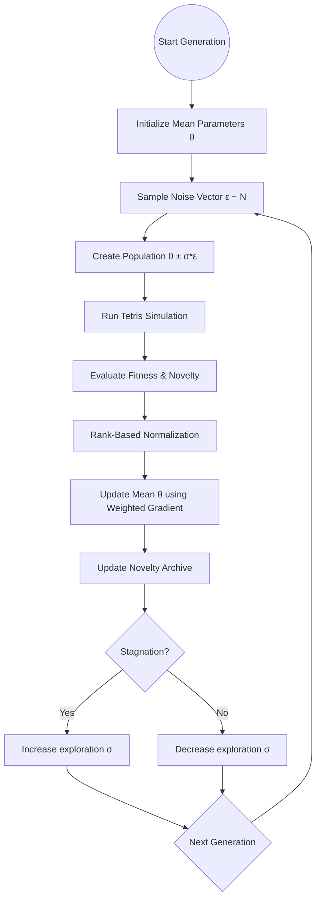

# TetrisML

A real-time Tetris genetic algorithm “aquarium.” Watch agents evolve, track lineage and telemetry, and persist progress across sessions.

## Features
-   **Realistic Movement Engine**: Uses BFS pathfinding and sequential action queues. No piece teleportation.
-   **Enhanced Strategic Depth**: Filtered 2nd-piece lookahead and deep neural network (32-node hidden layer).
- Live simulation with population stats, diversity tracking, and auto-tuning mutation.
- Dedicated Web Worker keeps the UI responsive during heavy evolution cycles.
- Visual tooling: neural maps, telemetry, lineage tree, timeline snapshots, and high scores.
- Persistence to both `localStorage` and a Cloudflare Worker + KV backend.

## Tech Stack
- React + TypeScript + Vite
- Web Worker simulation engine (`services/simulation/simulation.worker.ts`)
- Cloudflare Worker backend (`backend/src/index.js`) with KV storage
- Recharts for charts, Lucide for icons, custom CSS

## Project Structure
- `App.tsx` — app shell, routes, persistence, worker wiring
- `components/` — shared UI elements
- `pages/` — page-level views (Arena, Telemetry, Lineage, etc.)
- `services/simulation/` — Tetris engine + genetic algorithm
- `backend/` — Cloudflare Worker and Wrangler config
- `public/` — static assets
- `dist/` — production build output (generated)

## Evolutionary Algorithm & Fitness
The simulation uses a gradient-free Evolutionary Strategy (ES) inspired by OpenAI's ES, optimized for neuroevolution in Tetris.

### Algorithm Flow


### Fitness Function
The fitness is a weighted heuristic reward for stable play, normalized by piece count to avoid rewarding "do-nothing" survival:

| Component | Weight | Purpose |
| :--- | :--- | :--- |
| **Lines Cleared** | +100 | Primary scoring objective |
| **Tetris Bonus** | +1000 | Heavily reward strategy |
| **Terminal Death** | -1500 | Discourage topping out |
| **Holes** | -45 | Penalty for trapped empty space |
| **Bumpiness** | -10 | Penalty for jagged board tops |
| **Height** | -15 | Penalty (linear height aware) |
| **Well Bonus** | +8 | Reward for tetris well maintenance |

```typescript
const computeFitness = (agent: TetrisGame) => {
    const metrics = agent.calculateMetrics();
    const score = agent.averageScore ?? agent.score;

    let fitness = score 
        + (agent.lines * 100) 
        + (agent.tetrisCount * 1000) 
        + (Math.min(12, metrics.wells) * 8)
        - (metrics.holes * 45) 
        - (metrics.bumpiness * 10) 
        - (metrics.maxHeight * 15);

    if (!agent.isAlive) fitness -= 1500;
    return fitness / Math.max(1, agent.piecesSpawned);
};
```

## Local Development
Frontend (root):
```bash
npm install
npm run dev
```

Backend (Cloudflare Worker):
```bash
cd backend
npm install
npm run dev
```
The worker defaults to `http://localhost:8787`. Update `API_BASE` in `App.tsx` if you want the frontend to use the local worker.

Production build preview:
```bash
npm run build
npm run preview
```

## Persistence & API
The frontend stores local state under `TetrisML-population-v1` and syncs to the Worker API:
- `GET /api/state` — fetch persisted population state
- `POST /api/state` — save state (JSON payload, 5MB max)
- `POST /api/reset` — clear persisted state

## Deployment (Cloudflare)
Backend:
1. `npx wrangler login`
2. Create a KV namespace in the Cloudflare dashboard.
3. Update `backend/wrangler.toml` with the KV `id` and `preview_id` (binding name is `KV`).
4. Deploy: `cd backend && npm run deploy`

Frontend:
1. `npm run build`
2. Deploy `dist/` (e.g., Cloudflare Pages via `npx wrangler pages deploy dist`)
